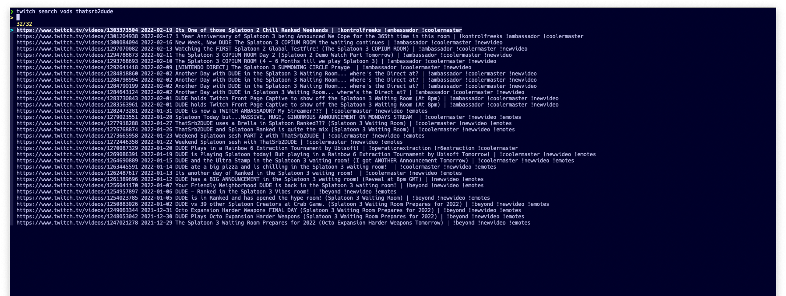

# Twitch Search Utility
Lists live followed channels and lists VoDs.

## Install
Usual Go tools: `go build .`, `go install .`.

You will also need to register your application
[on twitch](https://dev.twitch.tv/docs/api#register-an-app) and insert
`http://localhost:9001/callback` as redirect URL. Once you have client ID and
secret, put them in `~/.twitch-search-client.json` as:

```json
{
  "id": "<your-client-id>",
  "secret": "<your-client-secret>"
}
```

## Usage
Use the `-live` flag to list followed live channels.

List VoDs of channel given by `-vod`.

## fzf Integration
The following snippets integrate `twitch-search` with
[fzf](https://github.com/junegunn/fzf). They can be used to have interactive
search and starting your video player on the video that you select.

```bash
# List VoDs and start selection with streamlink
twitch_search_vods() {
  twitch-search -vod="$1" \
    | fzf --ansi --height=50% --layout=reverse \
    | awk '{print $1}' \
    | xargs -I{} -o bash -c 'mpv --terminal=no {} & echo {}'
}

# List live channels and start streamlink and chatterino on the selection
twitch_search_live() {
  twitch-search -live \
    | fzf --ansi --height=50% --layout=reverse \
    | awk '{print $1}' \
    | xargs -I{} -o bash -c 'mpv --terminal=no https://twitch.tv/{} & echo {}'
}
```


